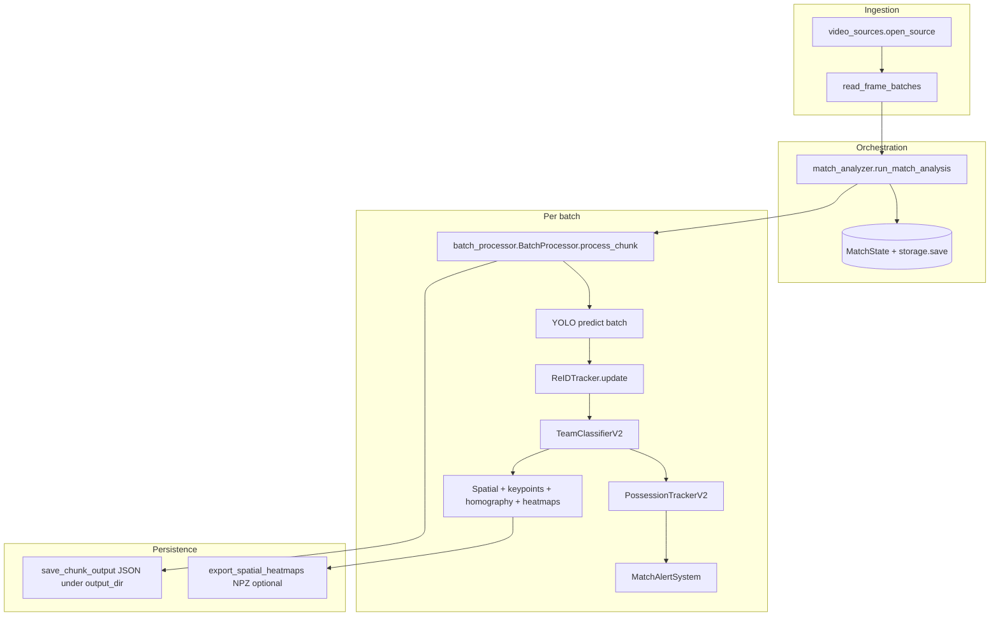

# TacticAI — Tactical football video analysis

Video match analysis with YOLO detection, ReID tracking, team classification, possession, passes, field calibration, heatmaps, and **algorithmic event prediction** with live alerts. The same codebase can run **locally** (classic WebSocket flow) or deploy as an **API + worker** stack aimed at Google Cloud.

[](https://www.python.org/)
[](https://pytorch.org/)
[](https://fastapi.tiangolo.com/)

---

## Repository map (summary)

| Area | Contents |
|------|----------|
| **CV pipeline** | `modules/` — YOLO, ReID, teams, possession, space, heatmaps, homography, alerts |
| **Legacy web** | `app.py` — upload, batched analysis, WebSocket, heatmap APIs |
| **Dual API (jobs)** | `app_service/` — FastAPI jobs API, pluggable storage/queue/DB |
| **Worker** | `worker/` — consumes queue and runs the same pipeline via `run_match_analysis` |
| **UI** | `templates/index.html`, `static/app.js`, `static/style.css` |
| **Infra** | Dockerfiles, compose, `cloudbuild.yaml`, `scripts/` |
| **DB** | SQLAlchemy + **Alembic** (`alembic/`, `scripts/db_manage.sh`) |
| **CI** | `.github/workflows/ci.yml` |
| **Tests** | `tests/` |
| **Docs** | `README_LOCAL.md`, `README_GCP.md`, `docs/TFG_TacticEYE2.md` |

---

## Two ways to run the backend

### 1) Legacy mode (recommended for the full local UI)

- **Entry:** `python app.py`
- **API:** `/api/upload`, `/api/analyze/{session_id}`, `/api/analyze/url`, `/api/heatmap/...`, `/api/attack-direction`, WebSocket `/ws/{session_id}`
- **UI:** templates and static files served from `app.py`
- **Port:** default `8001` (or `PORT`); if busy, another port may be chosen automatically

```bash
pip install -r requirements.txt
python app.py
# Open http://localhost:8001 (or the port printed in the console)
```

### 2) Dual API + same UI (`app_service`)

- **Entry:** `uvicorn app_service.main:app` (or `./scripts/run_local.sh`)
- **Routes:** `/` (HTML), `/static/...`, `/health`, `/jobs`, `/jobs/upload`, `/jobs/{id}`, `/jobs/{id}/results`
- **Jobs:** configurable queue (`sync`, `redis`, `pubsub`), storage (`local`, `gcs`), database via `DATABASE_URL`
- **Schema:** normal path uses **Alembic** only (`./scripts/db_manage.sh`)

```bash
export DATABASE_URL=sqlite:///./runtime_data/jobs.db
./scripts/db_manage.sh init-local
./scripts/run_local.sh
# Default PORT=8000 in the script; override with export PORT=...
```

---

## Frontend: dual mode without breaking local

In `static/app.js`:

- **`legacy`:** host is `localhost` or `127.0.0.1` — uses `/api/*` and WebSocket as before.
- **`jobs`:** host contains `run.app` (Cloud Run) — `POST /jobs` with `input_uri`, polling `GET /jobs/{id}` about every 2.5s; direct file upload in cloud shows a notice and expects a URL/URI.

Static paths already use `/static/...`; no HTML change required for that.

---

## Analysis pipeline (end-to-end)

This section describes **what actually runs** when you analyze a match: data flow, checkpoints, and which `modules/` files participate.

### What the pipeline produces

From raw video the stack derives:

- **Per-frame detections** — bounding boxes, class (`player`, `ball`, `referee`, `goalkeeper`), track IDs, team IDs for outfield players
- **Possession and passes** — ball–player proximity in image space, smoothed possession team/player, **possession-change** and **pass** events when the tracker state changes
- **Optional field / spatial layer** — field line keypoints, homography (with flip resolution), player feet projected to **105×68 m** pitch coordinates, **zone** labels, **heatmap** grids per team
- **Alerts** — `MatchAlertSystem` combines zone/possession/passing heuristics with **event scores** from `EventPredictionEngine` (linear metrics + sigmoid, driven by `config/predictions.yaml`), optional Anthropic wording (`prediction_anthropic.py`), and dispatches via `prediction_dispatcher.py`

All of that is implemented inside **`BatchProcessor.process_chunk()`** and orchestrated by **`run_match_analysis()`**.

### Entry points (same engine, different shells)

| Entry | File | Role |
|-------|------|------|
| Legacy web | `app.py` | Builds `AnalysisConfig`, wires WebSocket callbacks (`on_batch_complete`, `on_progress`, `on_frame_visualized`), optional `AttackDirectionManager` per session |
| Core API | `modules/match_analyzer.py` | **`run_match_analysis(match_id, config, resume=True)`** — load video, micro-batches, persist state, invoke callbacks |
| Jobs / worker | `app_service/providers/analysis/local.py` | **`LocalPipelineRunner`** — `AnalysisConfig` + `run_match_analysis(..., resume=False)` for uploaded files |

There is no second vision stack for cloud: the worker calls the same `run_match_analysis` path.

### High-level flow



### 1) Video ingestion (`modules/video_sources.py`)

- **`SourceType`**: uploaded file, YouTube VOD/live, Veo, HLS, RTMP, webcam
- **`open_source(type, path_or_url)`** — returns a source with metadata (fps, resolution, duration or live flag) and a **frame generator** (BGR `numpy` frames)
- **`read_frame_batches()`** — groups frames into chunks sized from **`AnalysisConfig.batch_size_seconds`** (or fixed frame count)

### 2) Orchestration loop (`modules/match_analyzer.py`)

1. **State** — Create or **resume** `MatchState` via `config.storage` or **`get_default_storage()`** → `FileSystemStorage` under the directory **`match_states/`** (one `{match_id}.json` checkpoint per save)
2. **Open video** — Attach fps/size to `MatchState.metadata`
3. **BatchProcessor** — Constructed once per run; loads the YOLO weights from `config.model_path`
4. **For each batch**  
   - `processor.process_chunk(match_state, frames, start_frame_idx, fps, …)`  
   - **`save_chunk_output()`** — writes per-batch JSON under **`config.output_dir`** (default **`outputs_streaming/{match_id}/`**: `detections_batch_*.json`, `positions_batch_*.json`, `events_batch_*.json`, `stats_batch_*.json`)  
   - **`storage.save(match_id, match_state)`** — checkpoint for resume / summary APIs  
   - Optional **`export_spatial_heatmaps`** to `{match_id}_heatmaps.npz` when spatial tracking is on  
   - **`on_batch_complete` / `on_progress` / `on_frame_visualized`** — used by `app.py` to push WebSocket updates and annotated preview frames (`WS_ENABLE_PREVIEW_FRAMES`)
5. **Finish** — `match_state.mark_completed()` and final heatmap export when enabled

### 3) Inside each chunk (`modules/batch_processor.py`)

Rough **per-frame** order inside `process_chunk` (after a batched YOLO `predict` on the whole chunk for GPU efficiency):

1. **Parse YOLO boxes** per frame (classes 0–3: player, ball, referee, goalkeeper)
2. **`ReIDTracker.update`** — stable track IDs across frames (see `modules/reid_tracker.py`)
3. **`TeamClassifierV2.add_detection` / `get_team`** — unsupervised team split from crop appearance (KMeans / voting); referees and ball get team `-1`
4. **Ball owner** — nearest **player** center within a pixel radius (~60 px) to ball center
5. **`PossessionTrackerV2.update`** — rolling possession team/player and accumulated frame counts → drives **pass** and **possession_change** **events** appended to the chunk list
6. **Spatial branch** (when `enable_spatial_tracking` is true — default in `BatchProcessor.__init__` is `True`):  
   - Periodic **`FieldKeypointsYOLO`** keypoints (`modules/field_keypoints_yolo.py`)  
   - **`FieldCalibratorKeypoints`** accumulates keypoints and estimates homography (`field_calibrator_keypoints.py`, `field_model_keypoints.py`)  
   - **`estimate_homography_with_flip_resolution`**, **`project_points`**, triangulation fallbacks from **`field_heatmap_system.py`**  
   - Optional **`OpticalFlowTracker`** (default **off** — expensive) and **`KalmanFilterPositionSmoother`** / **`TrajectoryValidator`** for projected feet positions  
   - **`SpatialPossessionTracker.update`** — zone model (`field_model.py` / `ZoneModel`) and legacy spatial state alongside heatmap accumulator bins  
   - Ball projected to field when calibration is valid — feeds **prediction context** (ball x,y in metres)
7. **`AttackDirectionManager`** (if injected) — period / direction hints from `modules/attack_direction_manager.py` and `config/` YAML consumed by alerts
8. **`MatchAlertSystem.analyze_and_generate_alerts`** — builds structured stats + **`prediction_context`**, runs prediction engine / dispatcher / optional LLM formatting; attaches **`alerts`** into `chunk_stats` for the UI

The chunk returns **`ChunkOutput`** (detections map, player positions list, events, stats, timing) plus the updated **`MatchState`**.

### 4) Prediction and schemas

- **`schemas/predictions.py`** — Pydantic models used by the prediction layer (distinct from the dataclass **`MatchState`** in `modules/match_state.py`, which is the runtime analysis state)
- **`modules/match_state_builder.py`** — adapts live stats into the structure **`EventPredictionEngine`** expects
- **`modules/prediction_metrics.py`** — features and scores fed into **`modules/event_prediction_engine.py`**
- **`modules/prediction_config.py`** + **`config/predictions.yaml`** — thresholds, event types, sigmoid scale
- **`modules/prediction_dispatcher.py`** — rate-limits / deduplicates emissions to the chat layer
- **`modules/prediction_anthropic.py`** — optional natural-language phrasing when API keys are set

### 5) Legacy web wiring (`app.py`)

- HTTP routes for upload, remote URL ingest, heatmap PNG/NPZ endpoints, attack-direction overrides
- **WebSocket** `/ws/{session_id}` streams batch summaries, alerts, and optionally annotated frames
- Uses **`FileSystemStorage`**, **`HeatmapAccumulator`**, and helpers aligned with **`field_heatmap_system`** for server-side heatmap APIs

### Module catalog (`modules/`)

| Module | Responsibility |
|--------|----------------|
| **`match_analyzer.py`** | `run_match_analysis`, `AnalysisConfig`, batch loop, resume, shortcuts (`analyze_local_file`, `analyze_youtube`, …) |
| **`batch_processor.py`** | `BatchProcessor`, `ChunkOutput`, `save_chunk_output`, spatial + alert integration |
| **`video_sources.py`** | Multi-source frame iterators and batching helpers |
| **`match_state.py`** | `MatchState`, sub-states (tracker, classifier, possession), `FileSystemStorage` / `RedisStorage` |
| **`reid_tracker.py`** | Re-identification tracking on top of detections |
| **`team_classifier_v2.py`** | Primary team classifier (KMeans + voting on jersey features) |
| **`possession_tracker_v2.py`** | Primary possession + pass statistics |
| **`match_alert_system.py`** | Tactical alerts + prediction hook-in |
| **`field_keypoints_yolo.py`** | Pitch keypoint detector used for homography |
| **`field_calibrator_keypoints.py`** / **`field_model_keypoints.py`** | Keypoint-based calibration pipeline |
| **`field_model.py`** | Field dimensions and zone partition helpers |
| **`field_heatmap_system.py`** | Homography resolution, projection helpers, `HeatmapAccumulator` |
| **`spatial_possession_tracker.py`** | Zone / spatial possession accumulation |
| **`optical_flow_tracker.py`** / **`position_smoother.py`** | Optional motion / smoothing path (flow disabled by default) |
| **`attack_direction_manager.py`** | Attack direction / period logic shared with UI |
| **`event_prediction_engine.py`** | Score-based event predictions |
| **`prediction_metrics.py`** / **`prediction_dispatcher.py`** / **`prediction_config.py`** | Metrics, emit policy, YAML-backed config |
| **`match_state_builder.py`** | Bridge live state → prediction `MatchState` model |
| **`prediction_anthropic.py`** | Optional LLM copy for alerts |
| **`tactical_analyzer.py`** | Deeper tactical strings when integrated |
| **`team_classifier.py`**, **`team_classifier_v2_backup.py`**, **`possession_tracker.py`** | Older or backup variants — not the main web path |
| **`field_calibration.py`**, **`field_line_detector.py`**, **`field_orientation.py`** | Alternate / supporting field geometry utilities |

---

## Environment variables (reference)

Copy and adapt:

- `.env.example` — general template
- `.env.local.example` — local compose (Postgres + Redis)
- `.env.cloud.example` — Cloud Run / Cloud SQL / GCS / Pub/Sub hints

Common keys: `APP_ENV`, `STORAGE_BACKEND`, `QUEUE_BACKEND`, `DATABASE_URL`, `LOCAL_STORAGE_PATH`, `GCP_*`, `GCS_*`, `PUBSUB_*`, `REDIS_URL`, `MODEL_PATH`, `PORT`, `LOG_LEVEL`, etc. (see `app_service/config.py`).

---

## Database and migrations (Alembic)

```bash
export DATABASE_URL=sqlite:///./runtime_data/jobs.db
./scripts/db_manage.sh init-local   # dirs, optional sqlite wipe, alembic upgrade head
./scripts/db_manage.sh upgrade      # migrations only
./scripts/db_manage.sh migrate "message"  # new autogenerated revision
```

In normal operation the jobs schema is **not** created with `create_all`; ephemeral test helpers exist if you need them (`build_ephemeral_test_session_factory` in `app_service/providers/database/session.py`).

---

## Worker

```bash
python worker/main.py
# or ./scripts/run_worker_local.sh (Redis-oriented defaults in that script)
```

The worker uses `LocalPipelineRunner` → `modules.match_analyzer.run_match_analysis` (same pipeline as local).

---

## Docker and Google Cloud

- `Dockerfile.web` — API image (`uvicorn app_service.main:app`)
- `Dockerfile.worker` — worker image
- `docker-compose.local.yml` — web + worker + redis + postgres
- `docker-compose.cloud.yml` — GPU-oriented worker hints
- `cloudbuild.yaml` — build and deploy to Cloud Run (Artifact Registry)
- Scripts: `scripts/create_gcp_resources.sh`, `scripts/deploy_web.sh`, `scripts/deploy_worker_vm.sh`

Detailed guides:

- **[README_LOCAL.md](README_LOCAL.md)** — local dev, compose, E2E checks, CI
- **[README_GCP.md](README_GCP.md)** — GCP resources, minimal deploy, Cloud SQL

---

## CI (GitHub Actions)

On every **push** and **pull request** to `main`:

1. `pip install -r requirements.txt` + test tooling
2. DB init with Alembic (`./scripts/db_manage.sh init-local`)
3. `pytest -q tests/test_dual_api_integration.py tests/test_worker_pipeline_real_call.py`

Workflow file: `.github/workflows/ci.yml`

---

## Tests

```bash
pip install pytest pytest-asyncio httpx pytest-mock
export DATABASE_URL=sqlite:///./runtime_data/jobs.db
./scripts/db_manage.sh init-local
pytest -q
# prediction / alerts only:
pytest -q tests/test_prediction_engine.py tests/test_alerts.py
```

Some tests patch heavy modules (`tests/conftest.py`) for fast legacy `app.py` checks; `app_service` tests use a real DB URL and migrations where applicable.

---

## CLI and legacy scripts

- **`pruebatrackequipo.py`** — command-line processing (video + ReID, possession, etc.)
- **`start_web.sh`** — web launcher if you use it in your setup
- **`setup_check.py`** — environment sanity checks

---

## Academic / thesis documentation

- **[docs/TFG_TacticEYE2.md](docs/TFG_TacticEYE2.md)** — long-form project write-up (TFG)

---

## Directory layout (overview)

```text
.
├── app.py                    # Legacy FastAPI + WebSocket + streaming analysis
├── app_service/              # Dual API: jobs, providers, config
├── worker/                   # Queue consumer + pipeline
├── modules/                  # Vision and analysis engine
├── schemas/                  # Pydantic (e.g. predictions)
├── config/                   # YAML (predictions, attack direction)
├── templates/                # index.html
├── static/                   # app.js, style.css
├── tests/
├── scripts/                  # run_local, db_manage, deploy, etc.
├── alembic/                  # migrations
├── docker-compose*.yml
├── Dockerfile.web
├── Dockerfile.worker
├── Dockerfile                # legacy / generic image in repo
├── cloudbuild.yaml
├── requirements.txt          # unified deps (web, cloud, alembic)
├── .github/workflows/
├── docs/
└── weights/                  # YOLO weights (avoid committing huge blobs)
```

---

## Requirements

- **Python:** 3.10+ (CI uses 3.11)
- **Hardware:** NVIDIA GPU recommended for reasonable full-match throughput; CPU works but is slower
- **Weights:** place `weights/best.pt` (or set `MODEL_PATH`)

---

## Quick troubleshooting

| Issue | Hint |
|-------|------|
| `table jobs already exists` with Alembic | Do not mix ad-hoc `create_all` with Alembic on the same DB; use `./scripts/db_manage.sh init-local` |
| Cloud Run UI without live stats | On `run.app`, `jobs` mode does not use WebSocket; extend polling or wire streaming endpoints |
| Dependencies | This branch uses **`requirements.txt` only** (no `requirements_web.txt`) |

---

## License and acknowledgements

- License: **MIT** — see `LICENSE`
- Detection: [Ultralytics YOLO](https://github.com/ultralytics/ultralytics)
- ReID / references: see historical notes and `docs/TFG_TacticEYE2.md`

---

## Contributing

1. Fork → feature branch → changes with tests and green CI  
2. Pull request to `main`

If you change the DB schema, add an Alembic revision and document new variables in `.env.example`.
